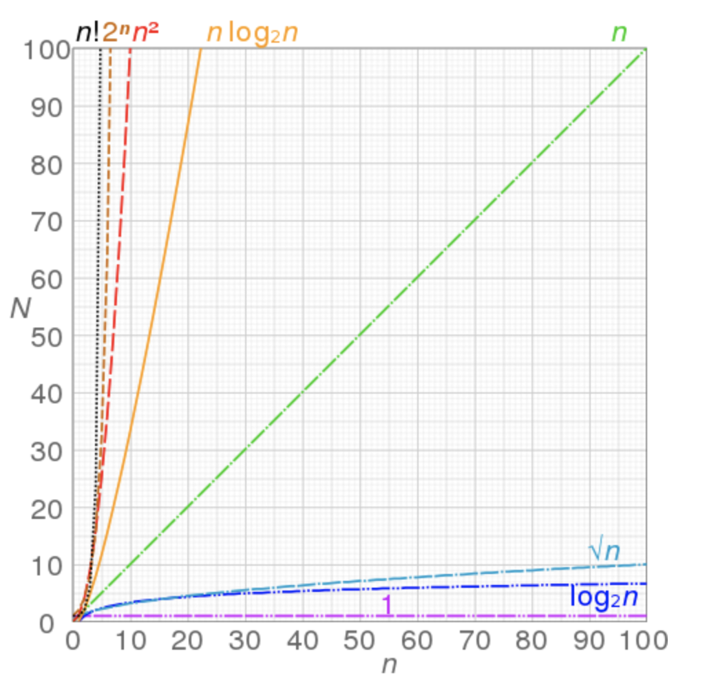

# Common Algorithms

Learning about different types of algorithms commonly used in coding.

**What is an algorithm??**

An algorithm is a finite sequence of well-defined, computer-implementable instructions, typically to solve a class of problems or to perform a computation. 

## Algorithm Type: Divide and Conquer
Divide and Conquer algorithms are a paradigm for solving problems that involve several basic steps. First, we divide the problem into smaller pieces and work to solve each of them independently. This can happen **recursively** - continuing to subdivide the 'pieces' until they are trivial enough to solve.

**Recursion** is defined as when the method / function supports the possibility of calling itself.

Once we’ve solved all of the pieces, we take all of the resulting smaller solutions and combine them into a single integrated comprehensive solution.

Example of a sorting algorithm (which is divide and conquer)


### Binary search
// TODO

### Certain Sorting algorithms (e.g., Merge Sort, Quicksort)
// TODO

## Algorithm: Bubble Sort
Bubble Sort is the simplest type of sorting algorithm. It works by repeatedly swapping the adjacent elements if they are in wrong order.

The bubble sort is named so because elements tend to move up into the correct order like bubbles rising to the surface.

## Note: Time Complexity

Great article: https://medium.com/swlh/time-complexity-of-algorithms-big-o-notation-explained-in-plain-english-e12a11dc4a4f

Time complexity is the computational complexity that describes the amount of time it takes to run an algorithm. `O(..n..)` (*Big O notation*) is used to quantify time complexity. An `O(1)` algorithm has complexity 1, and `O(n)` is entirely linear - the time taken to complete the algorithm is directly proportional to `n`.

See how the relationship between `O` and `n` affects the computation effort `N`:


### How do we measure time complexity?

One simple solution is to test your algorithm with a small dataset and measure the performance as you gradually add more data. However in reality, you can always have some abstract analysis of your code.

E.g. 2 nested loops would have time complexity `O(n^2)`

Here's an example of measuring the time complexity:

```java
  public static void main(String[] args) {
    int[] array = new int[]{1,2,4,-4,7,1,13,5};
    System.out.println(findMax(array));
  }

  public static int findMax(int[] array){
    int max = array[0]; // 1
    for (int v : array) { // 2
      if (v > max) max = v; // 3
    }
    return max; // 4
  }
```
* // 1 - 1 operation
* // 2 - A loop of size array.length
* // 3 - 1 operation

Which gives us a complexity of `1*n + 1` (where `n` is `array.length`). To apply Big O notation we only need the biggest order term so the complexity is `O(n)`.

### Time complexity `O(log n)`
Binary tree is `O(log n)`. It can be compared to looking up people in a phone book. You don't need to check every person in the phone book to find the right one. You can use divide-and-conquer by looking based on where their name is alphabetically, and in every section you only need to explore a subset of each section before you eventually find someone's phone number.


## Note: Hashing
A hashing algorithm takes an input of variable size to produce an output of fixed sized.

A high quality hashing algorithm:
* Has low collisions
* Uniformly spreads values over the 'problem space'
* Can securely identify the input (location) from the hash

A hash is not ‘encryption’ – it cannot be decrypted back to the original.

It allows you to quickly compare two files / objects by calculating their hash values.


**SHA-256** is a commonly used hashing algorithm.

### Hashcode application in java
`hashCode()` is used for bucketing in Hash implementations like `HashMap`, `HashTable`, `HashSet`, etc.

The value received from `hashCode()` is used as the bucket number for storing elements of the set/map. This bucket number is the address of the element inside the set/map.

When you do `contains()` it will take the hash code of the element, then look for the bucket where hash code points to. If more than 1 element is found in the same bucket (multiple objects can have the same hash code), then it uses the `equals()` method to evaluate if the objects are equal, to decide if `contains()` is true or false, or decide if element could be added in the set or not.

This is why, when overriding, you must always override equals and hashCode together, to satisfy their interdependent contracts.


## Note: Recursion
Do not confuse recursive with **tail-recursive** where you pass the results of your current step to the next recursive step. (The standard type of recursion is called 'head recursion')

**Head recursion**:
```java
// An example of a head recursive function 
static void print(int n) { 
    System.out.print(" " + n); 
    if (n > 0) {
        return print(n - 1); 
    }
    return;
} 
```

**Tail recursion**:

```java
// An example of tail recursive function 
static void print(int n) {
    System.out.print(" " + n);  
    if (n < 0) {
        return; 
    }
    // The last executed statement is the recursive call 
    print(n - 1); 
} 
```

## Note: Dynamic Programming
Dynamic programming is a paradigm for solving optimization problems. It consists of finding solutions for intermediate subproblems, which can be stored and reused for solving the actual problem. Dynamic programming is the best approach for difficult problems that always become trivial once we know the solution for a slightly easier instance of that problem - the intermediate subproblem. Dynamic programming solutions are best represented by a recursive relation.

If the intermediate subproblems are not overlapping, then we have just a case of using Divide and Conquer.

## Algorithm: Dijkstra

// TODO

## Algorithm: Prim

// TODO

Keep going through https://towardsdatascience.com/top-algorithms-and-data-structures-you-really-need-to-know-ab9a2a91c7b5

## Algorithm example - Two pointer technique (sorting algorithm)

Two pointers is really an easy and effective technique which is typically used for searching pairs in a sorted array.

The idea is to sort the array, and then work through it from either side, changing which side is 'shortened' depending on the outcome of the analysis.


A visual example:


### Example 3sum closest
Given an array of integers, A1, A2, ..., An, including negatives and positives, and another integer S. Now we need to find three different integers in the array, whose sum is closest to the given integer S*

This is an example of an algorithm that we could brute force in `O(n^3)` (loop through each value 3 times), but that can be rewritten to be an `O(n^2)` complexity sorting algorithm.

In `O(n^3)` (three loops):

```java
public static void main(String[] args) {
  int[] values = {1, 3, 5, -7, -2, 5, 20, 11, 1, 3, -5, 8, 9};
  threeSumClosest(values, 17);
}

private static int threeSumClosest(int[] values, int target){
  int closest = values[0] + values[1] + values[2];
  for (int i = 0; i < values.length; i++) {
    for (int j = 0; j < values.length; j++) {
      if(i == j){
        continue; // so we don't count identical indexes twice / thrice
      }
      for (int k = 0; k < values.length; k++) {
        if(i == k || j == k){
          continue; // so we don't count identical indexes twice / thrice
        }
        int sum = values[i] + values[j] + values[k];
        int distance = Math.abs(target - (values[i] + values[j] + values[k]));
        if(distance == 0) return sum;
        int closestDistance = Math.abs(target - closest);
        if (distance < closestDistance){
          System.out.println(String.format("NEW closest i = %s, j = %s, k = %s", values[i], values[j], values[k]));
          closest = sum;
        }
      }
    }
  }
  return closest;
}
```
```
NEW closest i = 1, j = 3, k = 20
NEW closest i = 1, j = 3, k = 11
NEW closest i = 1, j = 5, k = 11
```

In `O(n^2)`:

```java
public int threeSumClosest(int[] values, int target) {
    int min = Integer.MAX_VALUE; // cannot have a distance greater than this (so start here)
	int result = 0;
 
	Arrays.sort(values);
 
	for (int i = 0; i < values.length; i++) {
		int j = i + 1;
		int k = values.length - 1;
		while (j < k) {
			int sum = values[i] + values[j] + values[k];
			int diff = Math.abs(sum - target);
 
			if(diff == 0) return sum;
 
			if (diff < min) {
				min = diff;
				result = sum;
			}
			if (sum <= target) {
				j++;
			} else {
				k--;
			}
		}
	}
 
	return result;
}

```

Once we get to a `values[j]` for a certain `values[i]`/ `values[k]` that lead to our `sum` being greater than the target, decrement `values[k]`. 
If we go through all `values[j]` for a certain `values[i]`/ `values[k]` without exceeding the target, we should increment `values[i]`


