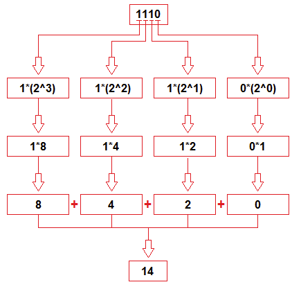
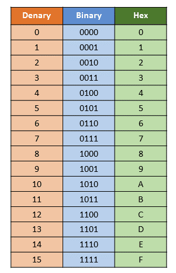

# Data types

## Basics

### Integers

Integers in Java are stored in **32 bits** (giving a range from -2,147,483,648 and 2,147,483,647)

```java
System.out.println(Integer.MAX_VALUE) // prints 2,147,483,647
System.out.println(Integer.MIN_VALUE) // prints -2,147,483,648
```

The max value of an Integer is `0x7fffffff` - this is hexadecimal.

### Bytes
Bytes are stored in **8 bits**, and therefore have a value range from -128 to 127.

They are mostly used to save memory and when you are certain that the numbers would be in the limit specified by byte data type

### Long
Stored in **8 bytes = 64 bits**. Used when int is not large enough to hold the value, it has wider range than int data type, ranging from -9,223,372,036,854,775,808 to 9,223,372,036,854,775,807.

```java
long num = -12332252626L; //declaration
```

If something larger than Long is needed, `BigInteger` can be used.

### Short
Stored in **4 bytes = 16 bits**. Greater than byte in terms of size and less than integer. Its range is -32,768 to 32767.

```java
short num = 45678; //declaration
```

### Char
Holds characters. Size **2 bytes**.


### Double
Sufficient for holding 15 decimal digits. Size **8 bytes**. If a decimal number with more decimals is needed than double, `BigDecimal` can be used.

### Float
Sufficient for holding 6 - 7 decimal digits. Size **4 bytes**

## Conversion between different types

```java
// Widening
int i = 10;
long l = i; // automatic

//Narrowing
long d = 10;
short l = (short) d; //explicit type casting

// Numeric > String
String str = String.valueOf(i);

// String> Numeric
int i = Integer.parseInt(str);

```
## Notation

### Binary

In binary notation, base 2, integers are written using only 0s and 1s. Some examples:

```
0b101 → 5 (can also see in below table)
0b11111111 → 255
```

They are always preceded by the prefix `0b`.

Converting a binary number to decimal:



### Hexadecimal

In hexadecimal, there are 16 digits: 0, 1, 2, 3, 4, 5, 6, 7, 8, 9, A, B, C, D, E, and F, representing all the possible values of 4 bits:



Here are some examples of hex notation, using the above:
```
0x25 = 37
0xa = 10
0x100 = 256
0xabcd9876 = 9007199254740992
```
They are always preceded by the prefix `0x`.

Therefore `0x7fffffff` represents the max integer value because it has 8 values (32 bits in integer / 4 bits per value = 8), and the first bit is `0` to indicate it is positive. It corresponds to `01111111111111111111111111111111`.

## Bitwise operations

Examples of different bitwise operation types:

```
        OR  AND XOR COMPLEMENT
A	B	A|B	A&B	A^B	~A
0	0	0	0	0	1
1	0	1	0	1	0
0	1	1	0	1	1
1	1	1	1	0	0
```
``` java
int value1 = 6;
int value2 = 5;
int result = value1 ^ value2;
System.out.println(result) // 3
```
```
0110
0101
-----
0011 // 3
```

Their use cases include:
* Communication stacks where the individual bits in the header attached to the data signify important information
* In embedded systems to set/clear/toggle just one single bit of a specific register without modifying the remaining bits
* To encrypt data for safety issues using the XOR operator
* In data compression by converting data from one representation to another, to reduce the amount of space used